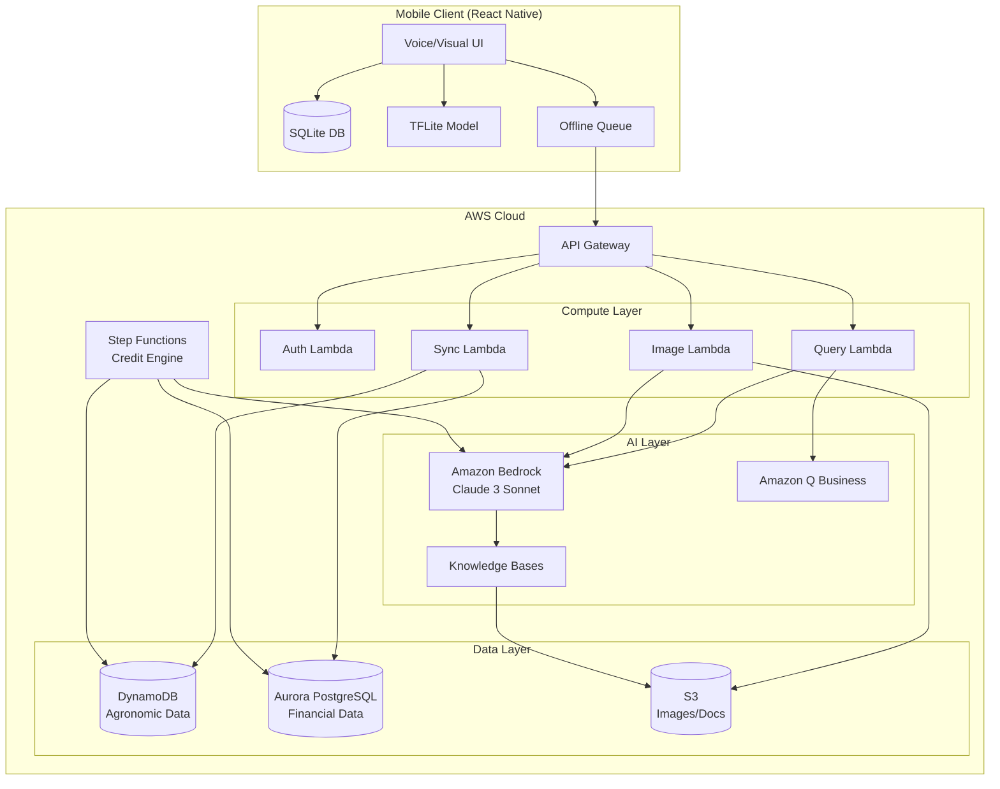

# Design Document: Farm Sutra

## Overview

Farm Sutra is an offline-first agricultural super-app built on AWS serverless architecture, designed to serve 100M+ Indian smallholder farmers in low-connectivity environments. The system implements a "Data Flywheel" philosophy where agronomic data validates financial decisions, utilizing Amazon Bedrock and Amazon Q as core intelligence engines.

### Core Design Principles

1. **Offline-First Architecture**: All critical operations work without internet connectivity
2. **AI-Powered Intelligence**: Amazon Bedrock (Claude 3 Sonnet) and Amazon Q provide natural language interfaces
3. **Hybrid AI Processing**: Edge (TFLite) for instant results, Cloud (Bedrock) for verification
4. **Serverless Scalability**: AWS Lambda, API Gateway, and managed services auto-scale
5. **Data Integrity**: Eventually consistent sync with conflict resolution
6. **Voice-First UX**: Vernacular voice interfaces for low-literacy users

### Technology Stack

- **Mobile**: React Native (iOS/Android)
- **API Layer**: Amazon API Gateway + AWS Lambda (Node.js/Python)
- **AI/ML**: Amazon Bedrock (Claude 3 Sonnet), Amazon Q Business, TensorFlow Lite
- **Databases**: Amazon DynamoDB (offline-sync), Amazon Aurora PostgreSQL (financial), SQLite (on-device)
- **Storage**: Amazon S3 (images, documents)
- **Orchestration**: AWS Step Functions (credit scoring)
- **Sync**: AWS AppSync (optional) or Lambda-based custom sync
- **Knowledge**: Amazon Knowledge Bases (RAG for government PDFs)
- **Auth**: Amazon Cognito
- **Monitoring**: Amazon CloudWatch

## Architecture

### High-Level Architecture




### Data Flow Patterns

#### Pattern 1: Offline-First Operations
1. User performs action in Mobile Client
2. Data written to local SQLite
3. Operation queued in Offline Queue
4. When online: Queue drains to API Gateway → Lambda → DynamoDB/Aurora
5. Sync Manager pulls server changes back to SQLite

#### Pattern 2: AI Query (Kisaan Saathi)
1. Voice input → Speech-to-Text (device or cloud)
2. Text query → API Gateway → Lambda
3. Lambda invokes Bedrock Agent with RAG
4. Bedrock queries Knowledge Bases (vector search on S3 PDFs)
5. Response → Text-to-Speech → Audio output

#### Pattern 3: Hybrid Diagnosis
1. Farmer captures crop image
2. **Offline**: TFLite model runs on-device → Instant result
3. **Online**: Image uploaded to S3 → Lambda triggers Bedrock multi-modal analysis
4. Bedrock returns verified diagnosis + treatment plan
5. Both results displayed (offline marked as "preliminary")

#### Pattern 4: Credit Score Calculation
1. Trigger event (monthly cron or significant farming activity)
2. Step Functions workflow starts
3. Step 1: Aggregate data from DynamoDB (agronomic) + Aurora (financial)
4. Step 2: Invoke Bedrock for creditworthiness summary
5. Step 3: Calculate numerical score (300-900)
6. Step 4: Store in Aurora with audit trail

## Components and Interfaces

### Mobile Client Components

#### 1. Voice Interface Module
**Responsibilities:**
- Capture voice input with noise filtering
- Convert speech to text (regional languages)
- Convert text responses to speech
- Manage audio playback

**Interfaces:**
```typescript
interface VoiceInterface {
  startRecording(language: string): Promise<void>
  stopRecording(): Promise<AudioBuffer>
  speechToText(audio: AudioBuffer): Promise<string>
  textToSpeech(text: string, language: string): Promise<AudioBuffer>
  playAudio(audio: AudioBuffer): Promise<void>
}
```

#### 2. Offline Queue Manager
**Responsibilities:**
- Queue operations when offline
- Persist queue to SQLite
- Drain queue when connectivity restored
- Handle retry logic with exponential backoff

**Interfaces:**
```typescript
interface OfflineQueueManager {
  enqueue(operation: Operation): Promise<void>
  dequeue(): Promise<Operation | null>
  drainQueue(): Promise<SyncResult>
  getQueueSize(): number
}

interface Operation {
  id: string
  type: 'CREATE' | 'UPDATE' | 'DELETE'
  entity: string
  payload: any
  timestamp: number
  retryCount: number
}
```

#### 3. Sync Manager
**Responsibilities:**
- Synchronize SQLite with DynamoDB
- Resolve conflicts (last-write-wins, server precedence)
- Maintain sync state and watermarks

**Interfaces:**
```typescript
interface SyncManager {
  syncUp(): Promise<SyncResult>
  syncDown(): Promise<SyncResult>
  resolveConflict(local: Entity, remote: Entity): Entity
  getLastSyncTimestamp(): number
}

interface SyncResult {
  success: boolean
  itemsSynced: number
  conflicts: Conflict[]
  errors: Error[]
}
```

#### 4. TFLite Diagnosis Engine
**Responsibilities:**
- Load TFLite model on app start
- Preprocess crop images
- Run inference for disease detection
- Return top-k predictions with confidence scores

**Interfaces:**
```typescript
interface TFLiteDiagnosisEngine {
  loadModel(modelPath: string): Promise<void>
  diagnose(image: ImageBuffer): Promise<DiagnosisResult>
  getSupportedDiseases(): string[]
}

interface DiagnosisResult {
  disease: string
  confidence: number
  treatments: string[]
  isOffline: boolean
}
```

### Backend Lambda Functions

#### 1. Auth Lambda
**Responsibilities:**
- User registration and login
- Token generation and validation
- Role-based access control

**API Endpoints:**
```
POST /auth/register
POST /auth/login
POST /auth/refresh
GET /auth/verify
```

#### 2. Sync Lambda
**Responsibilities:**
- Receive offline queue operations
- Write to DynamoDB (agronomic) or Aurora (financial)
- Return server-side changes since last sync

**API Endpoints:**
```
POST /sync/up
GET /sync/down?lastSync={timestamp}
POST /sync/resolve-conflict
```

#### 3. Kisaan Saathi Lambda
**Responsibilities:**
- Receive farmer queries
- Invoke Bedrock Agent with RAG
- Return AI-generated responses

**API Endpoints:**
```
POST /kisaan-saathi/query
GET /kisaan-saathi/history
```

**Bedrock Integration:**
```python
import boto3

bedrock = boto3.client('bedrock-agent-runtime')

def query_kisaan_saathi(query: str, language: str) -> str:
    response = bedrock.invoke_agent(
        agentId='kisaan-saathi-agent-id',
        agentAliasId='PROD',
        sessionId=generate_session_id(),
        inputText=query,
        enableTrace=True
    )
    
    # Extract response from Bedrock Agent
    answer = parse_bedrock_response(response)
    return answer
```

#### 4. FPO Dashboard Lambda
**Responsibilities:**
- Receive natural language queries from FPO admins
- Invoke Amazon Q Business
- Return formatted results

**API Endpoints:**
```
POST /fpo/query
GET /fpo/reports
```

**Amazon Q Integration:**
```python
import boto3

q_business = boto3.client('qbusiness')

def query_fpo_data(query: str, admin_id: str) -> dict:
    response = q_business.chat_sync(
        applicationId='fpo-dashboard-app-id',
        userId=admin_id,
        userMessage=query
    )
    
    return {
        'answer': response['systemMessage'],
        'sources': response.get('sourceAttributions', [])
    }
```

#### 5. Image Diagnosis Lambda
**Responsibilities:**
- Receive crop images from S3 events
- Invoke Bedrock multi-modal model
- Generate treatment plans
- Store results in DynamoDB

**Bedrock Multi-Modal Integration:**
```python
def diagnose_with_bedrock(image_s3_uri: str) -> dict:
    bedrock = boto3.client('bedrock-runtime')
    
    prompt = """Analyze this crop image and identify any diseases.
    Provide: 1) Disease name, 2) Confidence level, 3) Treatment plan"""
    
    response = bedrock.invoke_model(
        modelId='anthropic.claude-3-sonnet-20240229-v1:0',
        body=json.dumps({
            'anthropic_version': 'bedrock-2023-05-31',
            'max_tokens': 1024,
            'messages': [{
                'role': 'user',
                'content': [
                    {'type': 'image', 'source': {'type': 's3', 's3_uri': image_s3_uri}},
                    {'type': 'text', 'text': prompt}
                ]
            }]
        })
    )
    
    return parse_diagnosis_response(response)
```

### Step Functions: Credit Score Engine

**Workflow Definition:**
```json
{
  "Comment": "Kisaan Credit Score Calculation",
  "StartAt": "AggregateData",
  "States": {
    "AggregateData": {
      "Type": "Task",
      "Resource": "arn:aws:lambda:REGION:ACCOUNT:function:aggregate-farmer-data",
      "Next": "GenerateSummary"
    },
    "GenerateSummary": {
      "Type": "Task",
      "Resource": "arn:aws:lambda:REGION:ACCOUNT:function:bedrock-credit-summary",
      "Next": "CalculateScore"
    },
    "CalculateScore": {
      "Type": "Task",
      "Resource": "arn:aws:lambda:REGION:ACCOUNT:function:calculate-credit-score",
      "Next": "StoreScore"
    },
    "StoreScore": {
      "Type": "Task",
      "Resource": "arn:aws:lambda:REGION:ACCOUNT:function:store-credit-score",
      "End": true
    }
  }
}
```

**Credit Score Calculation Logic:**
```python
def calculate_credit_score(aggregated_data: dict, bedrock_summary: str) -> int:
    # Base score
    score = 500
    
    # Agronomic factors (40%)
    score += aggregated_data['crop_yield_percentile'] * 2  # 0-200 points
    score += aggregated_data['input_purchase_regularity'] * 1  # 0-100 points
    
    # Financial factors (40%)
    score += aggregated_data['loan_repayment_rate'] * 2  # 0-200 points
    score -= aggregated_data['days_overdue'] * 0.5  # Penalty
    
    # AI-derived factors (20%)
    ai_score = extract_ai_score_from_summary(bedrock_summary)
    score += ai_score  # 0-100 points
    
    # Clamp to 300-900 range
    return max(300, min(900, int(score)))
```

## Data Models

### DynamoDB Tables

#### Table: FarmerProfiles
**Partition Key:** farmerId (String)
**Attributes:**
- name: String
- phone: String
- language: String (hi, ta, te, kn, mr, bn, gu, pa)
- location: Map {latitude: Number, longitude: Number, district: String}
- fpoId: String
- registrationDate: Number (timestamp)
- lastSyncTimestamp: Number

#### Table: AgronomicActivities
**Partition Key:** farmerId (String)
**Sort Key:** activityTimestamp (Number)
**Attributes:**
- activityId: String
- activityType: String (SOWING, IRRIGATION, FERTILIZER, PESTICIDE, HARVEST)
- cropType: String
- quantity: Number
- unit: String
- notes: String
- imageS3Uri: String (optional)
- syncStatus: String (PENDING, SYNCED)

#### Table: CropDiagnoses
**Partition Key:** diagnosisId (String)
**Attributes:**
- farmerId: String
- imageS3Uri: String
- offlineDiagnosis: Map {disease: String, confidence: Number}
- onlineDiagnosis: Map {disease: String, confidence: Number, treatment: String}
- timestamp: Number
- verified: Boolean

#### Table: ChatHistory
**Partition Key:** farmerId (String)
**Sort Key:** timestamp (Number)
**Attributes:**
- sessionId: String
- query: String
- response: String
- language: String
- voiceInput: Boolean

### Aurora PostgreSQL Schema

#### Table: financial_transactions
```sql
CREATE TABLE financial_transactions (
    transaction_id UUID PRIMARY KEY,
    farmer_id VARCHAR(50) NOT NULL,
    fpo_id VARCHAR(50) NOT NULL,
    transaction_type VARCHAR(20) NOT NULL, -- LOAN, PAYMENT, PURCHASE
    amount DECIMAL(10, 2) NOT NULL,
    currency VARCHAR(3) DEFAULT 'INR',
    status VARCHAR(20) NOT NULL, -- PENDING, COMPLETED, FAILED
    created_at TIMESTAMP NOT NULL,
    updated_at TIMESTAMP NOT NULL,
    metadata JSONB,
    CONSTRAINT fk_farmer FOREIGN KEY (farmer_id) REFERENCES farmers(farmer_id)
);

CREATE INDEX idx_farmer_transactions ON financial_transactions(farmer_id, created_at);
CREATE INDEX idx_fpo_transactions ON financial_transactions(fpo_id, created_at);
```

#### Table: credit_scores
```sql
CREATE TABLE credit_scores (
    score_id UUID PRIMARY KEY,
    farmer_id VARCHAR(50) NOT NULL UNIQUE,
    score INTEGER NOT NULL CHECK (score BETWEEN 300 AND 900),
    calculation_date TIMESTAMP NOT NULL,
    factors JSONB NOT NULL, -- Detailed breakdown
    bedrock_summary TEXT,
    version INTEGER NOT NULL,
    CONSTRAINT fk_farmer FOREIGN KEY (farmer_id) REFERENCES farmers(farmer_id)
);

CREATE INDEX idx_score_date ON credit_scores(calculation_date);
```

#### Table: farmers
```sql
CREATE TABLE farmers (
    farmer_id VARCHAR(50) PRIMARY KEY,
    name VARCHAR(100) NOT NULL,
    phone VARCHAR(15) UNIQUE NOT NULL,
    fpo_id VARCHAR(50),
    kyc_status VARCHAR(20) DEFAULT 'PENDING',
    created_at TIMESTAMP NOT NULL,
    updated_at TIMESTAMP NOT NULL
);
```

### SQLite Schema (On-Device)

```sql
-- Mirror of DynamoDB tables for offline access
CREATE TABLE farmer_profiles (
    farmer_id TEXT PRIMARY KEY,
    name TEXT NOT NULL,
    phone TEXT NOT NULL,
    language TEXT NOT NULL,
    location_json TEXT,
    fpo_id TEXT,
    registration_date INTEGER,
    last_sync_timestamp INTEGER
);

CREATE TABLE agronomic_activities (
    activity_id TEXT PRIMARY KEY,
    farmer_id TEXT NOT NULL,
    activity_timestamp INTEGER NOT NULL,
    activity_type TEXT NOT NULL,
    crop_type TEXT,
    quantity REAL,
    unit TEXT,
    notes TEXT,
    image_s3_uri TEXT,
    sync_status TEXT DEFAULT 'PENDING',
    FOREIGN KEY (farmer_id) REFERENCES farmer_profiles(farmer_id)
);

CREATE TABLE offline_queue (
    queue_id INTEGER PRIMARY KEY AUTOINCREMENT,
    operation_type TEXT NOT NULL,
    entity_type TEXT NOT NULL,
    entity_id TEXT NOT NULL,
    payload_json TEXT NOT NULL,
    timestamp INTEGER NOT NULL,
    retry_count INTEGER DEFAULT 0
);

CREATE INDEX idx_queue_timestamp ON offline_queue(timestamp);
CREATE INDEX idx_activities_farmer ON agronomic_activities(farmer_id, activity_timestamp);
```

### S3 Bucket Structure

```
farm-sutra-data/
├── crop-images/
│   ├── {farmerId}/
│   │   └── {timestamp}-{diagnosisId}.jpg
├── knowledge-base/
│   ├── government-pdfs/
│   │   ├── pest-management-hindi.pdf
│   │   ├── fertilizer-guidelines-tamil.pdf
│   │   └── ...
├── tflite-models/
│   ├── crop-disease-v1.tflite
│   └── model-metadata.json
└── user-uploads/
    └── {farmerId}/
        └── {activityId}-{filename}
```


## Correctness Properties

*A property is a characteristic or behavior that should hold true across all valid executions of a system—essentially, a formal statement about what the system should do. Properties serve as the bridge between human-readable specifications and machine-verifiable correctness guarantees.*

### Property Reflection

After analyzing all 72 acceptance criteria, I identified the following redundancies and consolidations:

**Consolidations:**
- Properties 1.2 and 1.3 (Bedrock routing and RAG retrieval) can be combined into a single property about end-to-end query processing
- Properties 3.3 and 3.4 (S3 upload and Bedrock analysis) can be combined into online diagnosis workflow
- Properties 4.2 and 4.3 (offline queueing and upload) are part of the same round-trip property
- Properties 4.4 and 4.5 (conflict resolution and bidirectional sync) can be combined into comprehensive sync property
- Properties 9.1, 9.2, and 9.3 (pesticide safety checks) can be combined into comprehensive safety validation

**Redundancies Eliminated:**
- Property 5.1 (recording activities) is subsumed by the offline sync properties
- Property 8.2 (embedding creation) is an implementation detail of 8.1 (ingestion)
- Property 12.1 (encryption at rest) is infrastructure configuration, covered by example tests

**Result:** 45 unique testable properties after consolidation

### Properties

#### Kisaan Saathi (AI Chatbot)

**Property 1: End-to-end query processing with RAG**
*For any* farmer query text and language, when sent to Kisaan Saathi, the system should invoke Bedrock Agent, retrieve relevant context from Knowledge Base using RAG, and return a response in the same language.
**Validates: Requirements 1.2, 1.3, 1.4**

**Property 2: Offline query queueing round-trip**
*For any* query submitted while offline, the query should be stored in the Offline Queue and successfully processed when connectivity is restored, producing the same result as if submitted online.
**Validates: Requirements 1.5**

**Property 3: AI safety for harmful pesticides**
*For any* query involving known harmful or restricted pesticides, the Bedrock Agent response should not contain dangerous application instructions and should suggest safe alternatives.
**Validates: Requirements 1.7**

#### FPO Dashboard

**Property 4: Amazon Q query routing**
*For any* natural language query from an authenticated FPO admin, the system should invoke Amazon Q Business and return formatted results.
**Validates: Requirements 2.1, 2.3**

**Property 5: Authorization before sensitive queries**
*For any* query requesting sensitive financial data, the system should verify admin permissions before executing, and reject unauthorized requests.
**Validates: Requirements 2.5**

#### Hybrid Diagnosis

**Property 6: Image compression invariant**
*For any* crop image captured by the mobile client, after compression the file size should be under 500KB.
**Validates: Requirements 3.1**

**Property 7: Offline diagnosis availability**
*For any* crop image, when the mobile client is offline, the TFLite model should return a diagnosis result with disease name and confidence score.
**Validates: Requirements 3.2**

**Property 8: Online diagnosis workflow**
*For any* crop image, when the mobile client is online, the image should be uploaded to S3 and Bedrock should analyze it using multi-modal capabilities, returning a verified diagnosis.
**Validates: Requirements 3.3, 3.4**

**Property 9: Treatment plan completeness**
*For any* online diagnosis result from Bedrock, the response should include disease name, confidence score, treatment plan, pesticide recommendations, and application instructions.
**Validates: Requirements 3.5**

#### Offline-First Synchronization

**Property 10: Offline operations queueing**
*For any* data operation (CREATE, UPDATE, DELETE) performed while offline, the operation should be stored in the Offline Queue with a timestamp and operation type.
**Validates: Requirements 4.2**

**Property 11: Sync round-trip consistency**
*For any* operation queued offline, when connectivity is restored, the operation should be uploaded to DynamoDB/Aurora, and the local SQLite should be updated with any server-side changes, maintaining data consistency.
**Validates: Requirements 4.3, 4.5**

**Property 12: Conflict resolution with server precedence**
*For any* data conflict during synchronization (same entity modified offline and on server), the Sync Manager should resolve using last-write-wins with server precedence.
**Validates: Requirements 4.4**

**Property 13: Financial transaction ACID properties**
*For any* financial transaction, it should either be fully committed to Aurora DB or fully rolled back, never leaving partial state.
**Validates: Requirements 4.6**

**Property 14: Sync retry with exponential backoff**
*For any* sync operation that fails due to network interruption, the system should retry up to 5 times with exponentially increasing delays between attempts.
**Validates: Requirements 4.7**

#### Credit Score Calculation

**Property 15: Credit score workflow execution**
*For any* credit score calculation trigger, the Credit Score Engine should execute the complete Step Functions workflow including data aggregation, Bedrock summary generation, score calculation, and storage.
**Validates: Requirements 5.2, 5.3, 5.4**

**Property 16: Credit score range invariant**
*For any* farmer data input, the calculated credit score should be an integer between 300 and 900 (inclusive).
**Validates: Requirements 5.5**

**Property 17: Credit score audit trail**
*For any* calculated credit score, the stored record in Aurora DB should include score value, calculation date, detailed factors breakdown, Bedrock summary, and version number.
**Validates: Requirements 5.7**

#### Voice Interface

**Property 18: Voice command audio feedback**
*For any* voice command recognized by the system, audio feedback confirming the action should be provided to the user.
**Validates: Requirements 6.2**

**Property 19: Low-confidence confirmation**
*For any* voice input with recognition confidence below 70%, the system should request user confirmation before executing the action.
**Validates: Requirements 6.3**

**Property 20: Visual feedback during voice operations**
*For any* voice recording or processing operation, the mobile client should display visual indicators showing the current state.
**Validates: Requirements 6.6**

#### 2G Network Optimization

**Property 21: API payload compression**
*For any* API request or response payload, when network conditions indicate 2G connectivity, the data should be compressed before transmission.
**Validates: Requirements 7.2**

**Property 22: Progressive image loading**
*For any* image loading operation, the system should first load a low-resolution preview before loading the full-resolution image.
**Validates: Requirements 7.3**

**Property 23: Request batching**
*For any* set of multiple API requests made within a short time window, the API Gateway should batch them into a single round-trip when possible.
**Validates: Requirements 7.4**

**Property 24: Adaptive sync on 2G**
*For any* network condition detected as 2G, the mobile client should disable non-essential background synchronization operations.
**Validates: Requirements 7.5**

**Property 25: Operation prioritization**
*For any* set of pending operations including both critical (credit transactions, disease diagnosis) and non-critical (analytics sync) operations, critical operations should be processed first.
**Validates: Requirements 7.6**

#### Knowledge Base Management

**Property 26: Automatic PDF ingestion**
*For any* government PDF uploaded to the S3 knowledge-base folder, the system should automatically ingest it into Knowledge Base and create vector embeddings.
**Validates: Requirements 8.1, 8.2**

**Property 27: Top-K retrieval**
*For any* Bedrock Agent query to the Knowledge Base, the system should retrieve exactly the top 5 most relevant document chunks (or fewer if less than 5 chunks exist).
**Validates: Requirements 8.3**

#### AI Safety

**Property 28: Pesticide safety validation**
*For any* pesticide recommendation generated by Bedrock Agent, the system should verify it against the approved chemical list, include safety warnings, protective equipment requirements, and refuse to provide instructions for restricted chemicals.
**Validates: Requirements 9.1, 9.2, 9.3**

**Property 29: Waiting period information**
*For any* query about human consumption of treated crops, the system response should include accurate waiting period information before consumption is safe.
**Validates: Requirements 9.5**

**Property 30: AI recommendation logging**
*For any* AI-generated recommendation (diagnosis, treatment, pesticide advice), the system should create a log entry with timestamp, user ID, query, and response for audit purposes.
**Validates: Requirements 9.6**

#### Financial Transaction Integrity

**Property 31: Transaction recording with ACID**
*For any* financial transaction initiated, it should be recorded in Aurora DB with full ACID guarantees (atomicity, consistency, isolation, durability).
**Validates: Requirements 10.1**

**Property 32: Transaction validation before commit**
*For any* offline financial transaction being synced, the Sync Manager should validate its integrity (correct format, valid amounts, authorized user) before committing to Aurora DB.
**Validates: Requirements 10.2**

**Property 33: Failed transaction quarantine**
*For any* transaction that fails validation, the system should quarantine it in a separate table, mark it for manual review, and send a notification to the FPO admin.
**Validates: Requirements 10.3**

**Property 34: Financial audit log completeness**
*For any* financial operation (transaction, update, deletion), an audit log entry should exist in Aurora DB containing timestamp, user ID, operation type, and affected data.
**Validates: Requirements 10.4**

**Property 35: Transaction deduplication**
*For any* set of transactions being synced, if duplicate transaction IDs are detected, the system should deduplicate them, keeping only one instance.
**Validates: Requirements 10.5**

#### Data Privacy and Security

**Property 36: Data deletion with analytics preservation**
*For any* farmer data deletion request, all personal identifiable information should be removed from DynamoDB and Aurora DB within 30 days, while anonymized analytics data should be preserved.
**Validates: Requirements 12.3**

**Property 37: Role-based access control**
*For any* API request, the system should verify that the authenticated user's role (farmer, FPO admin, system admin) has permission to perform the requested operation, and reject unauthorized requests.
**Validates: Requirements 12.4**

**Property 38: MFA for sensitive financial access**
*For any* request to access sensitive financial data by an FPO admin, the system should require successful multi-factor authentication before granting access.
**Validates: Requirements 12.5**

**Property 39: Secure token storage**
*For any* authentication token stored on the mobile client, it should be stored using platform-specific secure storage (iOS Keychain or Android Keystore), not in plain text or shared preferences.
**Validates: Requirements 12.6**

### Example-Based Tests

The following acceptance criteria are best validated through specific example tests rather than universal properties:

**Example 1: Language support verification**
Verify that Kisaan Saathi accepts and processes queries in all 8 supported languages: Hindi, Tamil, Telugu, Kannada, Marathi, Bengali, Gujarati, and Punjabi.
**Validates: Requirements 1.6**

**Example 2: FPO dashboard query types**
Verify that the FPO Dashboard successfully processes example queries for: farmer activities, harvest data, credit scores, and financial transactions.
**Validates: Requirements 2.4**

**Example 3: Unanswerable query handling**
Verify that when Amazon Q cannot answer a query due to missing data, it provides a clear explanation of what data is missing.
**Validates: Requirements 2.6**

**Example 4: Diagnosis conflict presentation**
Verify that when offline TFLite diagnosis and online Bedrock diagnosis differ significantly (e.g., different diseases), both results are displayed with the Bedrock result marked as "verified".
**Validates: Requirements 3.6**

**Example 5: TFLite disease coverage**
Verify that the TFLite model supports detection of at least 20 common diseases across rice, wheat, cotton, and sugarcane crops.
**Validates: Requirements 3.7**

**Example 6: Voice interface feature coverage**
Verify that voice input is available for all critical functions: queries to Kisaan Saathi, agronomic data entry, navigation, and disease diagnosis.
**Validates: Requirements 6.1**

**Example 7: App size constraint**
Verify that the built mobile application (APK/IPA) is under 50MB in size including all essential features.
**Validates: Requirements 7.1**

**Example 8: Knowledge base language support**
Verify that documents in English and all 8 regional languages can be ingested into Knowledge Base and successfully queried.
**Validates: Requirements 8.4**

**Example 9: Government source prioritization**
Verify that when document content conflicts, government-issued sources rank higher in Knowledge Base retrieval results than other sources.
**Validates: Requirements 8.5**

**Example 10: Dangerous pesticide combinations**
Verify that Bedrock Agent refuses to recommend known dangerous pesticide mixing combinations (e.g., specific test cases of incompatible chemicals).
**Validates: Requirements 9.4**

**Example 11: Transaction rollback capability**
Verify that an erroneous financial transaction can be successfully rolled back, restoring the previous state.
**Validates: Requirements 10.6**

**Example 12: Lambda timeout configuration**
Verify that Lambda functions have appropriate timeout configurations: 3 seconds for API handlers, 15 minutes for batch processing.
**Validates: Requirements 11.4**

**Example 13: Rate limit responses**
Verify that when API Gateway rate limits are exceeded, the system returns HTTP 429 (Too Many Requests) with appropriate retry-after headers.
**Validates: Requirements 11.5**

**Example 14: TLS 1.3 configuration**
Verify that all API Gateway endpoints are configured to use TLS 1.3 for encrypted communications.
**Validates: Requirements 12.2**


## Error Handling

### Error Categories

#### 1. Network Errors
**Scenarios:**
- No internet connectivity
- Intermittent 2G connection
- API Gateway timeouts
- S3 upload failures

**Handling Strategy:**
- Queue operations locally in Offline Queue
- Retry with exponential backoff (max 5 attempts)
- Show user-friendly offline indicators
- Gracefully degrade to offline-only features

**Implementation:**
```typescript
async function handleNetworkError(operation: Operation, error: NetworkError): Promise<void> {
  if (operation.retryCount < 5) {
    const delay = Math.pow(2, operation.retryCount) * 1000; // Exponential backoff
    await offlineQueue.enqueue({...operation, retryCount: operation.retryCount + 1});
    setTimeout(() => retryOperation(operation), delay);
  } else {
    await logError('Max retries exceeded', operation, error);
    await notifyUser('Operation will retry when connection improves');
  }
}
```

#### 2. AI Service Errors
**Scenarios:**
- Bedrock throttling (rate limits)
- Bedrock model errors (invalid input)
- Amazon Q unavailable
- Knowledge Base query failures

**Handling Strategy:**
- Implement circuit breaker pattern
- Fall back to cached responses when available
- For diagnosis: show offline TFLite result only
- Log all AI errors for monitoring

**Implementation:**
```python
class BedrockCircuitBreaker:
    def __init__(self, failure_threshold=5, timeout=60):
        self.failure_count = 0
        self.failure_threshold = failure_threshold
        self.timeout = timeout
        self.last_failure_time = None
        self.state = 'CLOSED'  # CLOSED, OPEN, HALF_OPEN
    
    def call_bedrock(self, operation):
        if self.state == 'OPEN':
            if time.time() - self.last_failure_time > self.timeout:
                self.state = 'HALF_OPEN'
            else:
                raise CircuitBreakerOpenError('Bedrock circuit breaker is open')
        
        try:
            result = operation()
            if self.state == 'HALF_OPEN':
                self.state = 'CLOSED'
                self.failure_count = 0
            return result
        except Exception as e:
            self.failure_count += 1
            self.last_failure_time = time.time()
            if self.failure_count >= self.failure_threshold:
                self.state = 'OPEN'
            raise e
```

#### 3. Data Validation Errors
**Scenarios:**
- Invalid crop image format
- Malformed financial transaction data
- Missing required fields
- Data type mismatches

**Handling Strategy:**
- Validate at mobile client before queueing
- Re-validate at Lambda before database write
- Quarantine invalid data for manual review
- Return clear error messages to users

**Validation Schema Example:**
```typescript
const FinancialTransactionSchema = {
  transaction_id: { type: 'string', required: true, format: 'uuid' },
  farmer_id: { type: 'string', required: true, minLength: 1 },
  amount: { type: 'number', required: true, min: 0, max: 10000000 },
  transaction_type: { type: 'string', required: true, enum: ['LOAN', 'PAYMENT', 'PURCHASE'] },
  timestamp: { type: 'number', required: true }
};

function validateTransaction(data: any): ValidationResult {
  const errors = [];
  for (const [field, rules] of Object.entries(FinancialTransactionSchema)) {
    if (rules.required && !data[field]) {
      errors.push(`Missing required field: ${field}`);
    }
    // Additional validation logic...
  }
  return { valid: errors.length === 0, errors };
}
```

#### 4. Synchronization Conflicts
**Scenarios:**
- Same entity modified offline and on server
- Concurrent updates from multiple devices
- Deleted entity modified offline

**Handling Strategy:**
- Last-write-wins with server precedence
- Preserve both versions in conflict log
- Notify user of conflicts for critical data (financial)
- Automatic resolution for non-critical data

**Conflict Resolution:**
```typescript
function resolveConflict(local: Entity, remote: Entity): Entity {
  // Server precedence for financial data
  if (local.entityType === 'FINANCIAL_TRANSACTION') {
    logConflict(local, remote, 'SERVER_WINS');
    return remote;
  }
  
  // Last-write-wins for agronomic data
  if (remote.updatedAt > local.updatedAt) {
    logConflict(local, remote, 'SERVER_WINS');
    return remote;
  } else {
    logConflict(local, remote, 'CLIENT_WINS');
    return local;
  }
}
```

#### 5. Authentication and Authorization Errors
**Scenarios:**
- Expired tokens
- Invalid credentials
- Insufficient permissions
- MFA failures

**Handling Strategy:**
- Auto-refresh tokens when expired
- Redirect to login on auth failure
- Show permission denied messages
- Log security events for audit

**Implementation:**
```typescript
async function handleAuthError(error: AuthError): Promise<void> {
  if (error.type === 'TOKEN_EXPIRED') {
    try {
      await refreshAuthToken();
      return retryOriginalRequest();
    } catch (refreshError) {
      await redirectToLogin();
    }
  } else if (error.type === 'INSUFFICIENT_PERMISSIONS') {
    await showError('You do not have permission to perform this action');
    await logSecurityEvent('UNAUTHORIZED_ACCESS_ATTEMPT', error);
  }
}
```

#### 6. AI Safety Violations
**Scenarios:**
- Harmful pesticide recommendations
- Dangerous chemical combinations
- Incorrect dosage information

**Handling Strategy:**
- Pre-filter queries for safety keywords
- Post-process AI responses for safety validation
- Block unsafe recommendations
- Log all safety violations for review

**Safety Filter:**
```python
RESTRICTED_CHEMICALS = ['paraquat', 'endosulfan', 'monocrotophos']
DANGEROUS_COMBINATIONS = [
    ('organophosphate', 'carbamate'),
    ('copper', 'lime_sulfur')
]

def validate_pesticide_safety(recommendation: str) -> SafetyResult:
    # Check for restricted chemicals
    for chemical in RESTRICTED_CHEMICALS:
        if chemical.lower() in recommendation.lower():
            log_safety_violation('RESTRICTED_CHEMICAL', chemical)
            return SafetyResult(safe=False, reason=f'Restricted chemical: {chemical}')
    
    # Check for dangerous combinations
    for combo in DANGEROUS_COMBINATIONS:
        if all(chem in recommendation.lower() for chem in combo):
            log_safety_violation('DANGEROUS_COMBINATION', combo)
            return SafetyResult(safe=False, reason=f'Dangerous combination: {combo}')
    
    return SafetyResult(safe=True)
```

### Error Monitoring and Alerting

**CloudWatch Alarms:**
- Lambda error rate > 5%
- API Gateway 5xx errors > 10 per minute
- DynamoDB throttling events
- Bedrock invocation failures
- Sync queue depth > 1000 items

**Error Logging:**
```python
import boto3
import json

cloudwatch = boto3.client('logs')

def log_error(error_type: str, context: dict, error: Exception):
    log_entry = {
        'timestamp': int(time.time() * 1000),
        'error_type': error_type,
        'error_message': str(error),
        'context': context,
        'stack_trace': traceback.format_exc()
    }
    
    cloudwatch.put_log_events(
        logGroupName='/aws/lambda/farm-sutra',
        logStreamName=f'{error_type}-{datetime.now().strftime("%Y-%m-%d")}',
        logEvents=[{
            'timestamp': log_entry['timestamp'],
            'message': json.dumps(log_entry)
        }]
    )
```

## Testing Strategy

### Dual Testing Approach

Farm Sutra requires both **unit tests** and **property-based tests** for comprehensive coverage:

- **Unit tests**: Verify specific examples, edge cases, and error conditions
- **Property tests**: Verify universal properties across all inputs using randomized testing

Both approaches are complementary and necessary. Unit tests catch concrete bugs in specific scenarios, while property tests verify general correctness across a wide input space.

### Property-Based Testing

**Framework Selection:**
- **Mobile (TypeScript/React Native)**: fast-check
- **Backend (Python)**: Hypothesis
- **Backend (Node.js)**: fast-check

**Configuration:**
- Minimum 100 iterations per property test (due to randomization)
- Each property test must reference its design document property
- Tag format: `Feature: farm-sutra, Property {number}: {property_text}`

**Example Property Test (TypeScript with fast-check):**
```typescript
import fc from 'fast-check';

describe('Farm Sutra - Offline Sync', () => {
  // Feature: farm-sutra, Property 10: Offline operations queueing
  it('should queue all offline operations with timestamps', async () => {
    await fc.assert(
      fc.asyncProperty(
        fc.record({
          type: fc.constantFrom('CREATE', 'UPDATE', 'DELETE'),
          entity: fc.constantFrom('ACTIVITY', 'DIAGNOSIS', 'PROFILE'),
          payload: fc.object(),
        }),
        async (operation) => {
          // Simulate offline mode
          await networkManager.setOffline(true);
          
          // Perform operation
          const result = await dataManager.performOperation(operation);
          
          // Verify it's queued
          const queuedOps = await offlineQueue.getAll();
          const found = queuedOps.find(op => 
            op.type === operation.type && 
            op.entity === operation.entity &&
            op.timestamp > 0
          );
          
          expect(found).toBeDefined();
          expect(found.timestamp).toBeGreaterThan(Date.now() - 1000);
        }
      ),
      { numRuns: 100 }
    );
  });
});
```

**Example Property Test (Python with Hypothesis):**
```python
from hypothesis import given, strategies as st
import pytest

# Feature: farm-sutra, Property 16: Credit score range invariant
@given(
    crop_yield=st.integers(min_value=0, max_value=10000),
    loan_repayment_rate=st.floats(min_value=0.0, max_value=1.0),
    days_overdue=st.integers(min_value=0, max_value=365),
    input_regularity=st.floats(min_value=0.0, max_value=1.0)
)
def test_credit_score_range_invariant(crop_yield, loan_repayment_rate, days_overdue, input_regularity):
    """For any farmer data input, credit score should be between 300-900"""
    aggregated_data = {
        'crop_yield_percentile': crop_yield / 100,
        'loan_repayment_rate': loan_repayment_rate,
        'days_overdue': days_overdue,
        'input_purchase_regularity': input_regularity
    }
    
    bedrock_summary = "Farmer shows consistent farming patterns"
    score = calculate_credit_score(aggregated_data, bedrock_summary)
    
    assert 300 <= score <= 900, f"Score {score} outside valid range"
    assert isinstance(score, int), "Score must be an integer"
```

### Unit Testing

**Focus Areas:**
- Specific examples demonstrating correct behavior
- Edge cases (empty inputs, boundary values, null handling)
- Error conditions and exception handling
- Integration points between components

**Example Unit Tests:**
```typescript
describe('Farm Sutra - Image Compression', () => {
  it('should compress large images to under 500KB', async () => {
    const largeImage = await loadTestImage('5MB-crop-image.jpg');
    const compressed = await imageCompressor.compress(largeImage);
    
    expect(compressed.size).toBeLessThan(500 * 1024);
  });
  
  it('should handle empty image gracefully', async () => {
    const emptyBuffer = Buffer.alloc(0);
    
    await expect(imageCompressor.compress(emptyBuffer))
      .rejects.toThrow('Invalid image data');
  });
  
  it('should preserve image format after compression', async () => {
    const jpgImage = await loadTestImage('test-crop.jpg');
    const compressed = await imageCompressor.compress(jpgImage);
    
    expect(compressed.format).toBe('jpeg');
  });
});
```

### Integration Testing

**Test Scenarios:**
1. **End-to-End Offline-to-Online Flow:**
   - Perform operations offline
   - Verify queue population
   - Restore connectivity
   - Verify sync completion
   - Verify data consistency

2. **AI Query Flow:**
   - Submit query to Kisaan Saathi
   - Verify Bedrock invocation
   - Verify Knowledge Base retrieval
   - Verify response generation
   - Verify voice output

3. **Hybrid Diagnosis Flow:**
   - Capture crop image
   - Verify offline TFLite diagnosis
   - Upload to S3
   - Verify Bedrock multi-modal analysis
   - Verify treatment plan generation

**Example Integration Test:**
```typescript
describe('Farm Sutra - Hybrid Diagnosis Integration', () => {
  it('should complete full diagnosis workflow', async () => {
    // Setup
    const testImage = await loadTestImage('rice-blast.jpg');
    await networkManager.setOffline(true);
    
    // Offline diagnosis
    const offlineResult = await diagnosisEngine.diagnose(testImage);
    expect(offlineResult.isOffline).toBe(true);
    expect(offlineResult.disease).toBeDefined();
    
    // Go online
    await networkManager.setOffline(false);
    
    // Online diagnosis
    const onlineResult = await diagnosisEngine.diagnose(testImage);
    expect(onlineResult.isOffline).toBe(false);
    expect(onlineResult.disease).toBeDefined();
    expect(onlineResult.treatments).toHaveLength(greaterThan(0));
    
    // Verify S3 upload
    const s3Object = await s3.getObject({
      Bucket: 'farm-sutra-data',
      Key: expect.stringContaining('crop-images')
    });
    expect(s3Object).toBeDefined();
  });
});
```

### Testing AWS Services

**Mocking Strategy:**
- Use AWS SDK mocks for unit tests (aws-sdk-mock, moto)
- Use LocalStack for local integration testing
- Use actual AWS services in staging environment

**Example Bedrock Mock:**
```typescript
import { mockClient } from 'aws-sdk-client-mock';
import { BedrockAgentRuntimeClient, InvokeAgentCommand } from '@aws-sdk/client-bedrock-agent-runtime';

const bedrockMock = mockClient(BedrockAgentRuntimeClient);

beforeEach(() => {
  bedrockMock.reset();
});

it('should invoke Bedrock Agent for queries', async () => {
  bedrockMock.on(InvokeAgentCommand).resolves({
    completion: 'Apply fungicide within 24 hours',
    sessionId: 'test-session'
  });
  
  const response = await kisaanSaathi.query('How to treat leaf rust?');
  
  expect(response).toContain('fungicide');
  expect(bedrockMock.calls()).toHaveLength(1);
});
```

### Performance Testing

**Key Metrics:**
- API response time (p50, p95, p99)
- Offline queue drain time
- Image compression time
- TFLite inference time
- Sync operation throughput

**Load Testing:**
- Simulate 10,000 concurrent farmers
- Test peak harvest season load
- Verify auto-scaling behavior
- Monitor Lambda cold starts

**Tools:**
- Artillery for API load testing
- AWS X-Ray for distributed tracing
- CloudWatch for metrics and alarms

### Test Coverage Goals

- **Unit Test Coverage**: 80% code coverage
- **Property Test Coverage**: All 39 properties implemented
- **Integration Test Coverage**: All critical user flows
- **Example Test Coverage**: All 14 example tests implemented

### Continuous Testing

**CI/CD Pipeline:**
1. Run unit tests on every commit
2. Run property tests (100 iterations) on every PR
3. Run integration tests on staging deployment
4. Run performance tests weekly
5. Run security scans (SAST/DAST) on every release

**Test Execution Time:**
- Unit tests: < 5 minutes
- Property tests: < 15 minutes
- Integration tests: < 30 minutes
- Full test suite: < 1 hour

